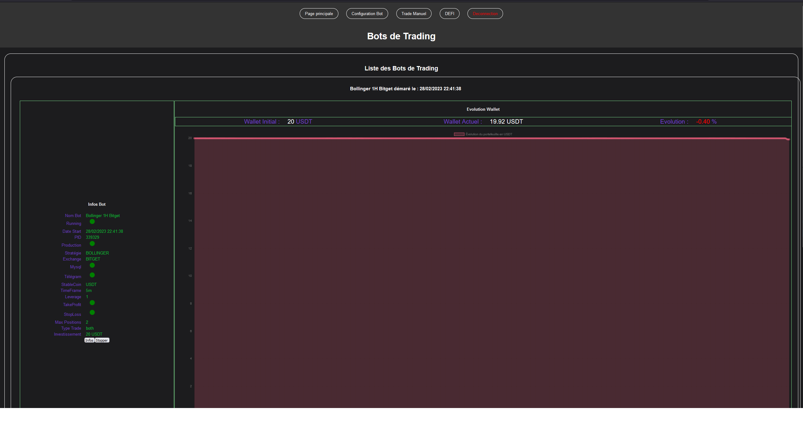

# Trading-Machine

Ce projet est un bot de trading qui peut également être utilisé en mode manuel.

## Installation

1. Téléchargé le fichier d'installation `wget https://raw.githubusercontent.com/telecom4all/Trading-Machine/main/scripts_app/install.sh`
2. executé l'installation `bash install.sh`
3. a la fin de l'installation le not se lance et vous pouvez y acceder par le web via : http://<domaine> avec le mot de passe 123456

4. Cryptez votre nouveau mot de passe en exécutant `node crypt_password.js` et modifier la valeur dansle fichier config_secret.json ainsi que "mysql_active": true si vous voulez mysql

5. ### Telegram
    je vous renvoie a ce lien pour créer votre bot télégram pour avoir votre token a mettre dans le fichier config_secret.json :
    
    https://medium.com/@robertbracco1/how-to-write-a-telegram-bot-to-send-messages-with-python-bcdf45d0a580

    puis pour trouver votre id télegram, envoyé un message depuis votre bot telegram a : 
      `@getidsbot`.
    puis cliquez sur "you" et vous verrai votre id a mettre dans le fichier config_secret.json

6. ### double authentification
    pour la double authentification il faut mettre la variable `is2fa = true`  et il faut activé la double authentification sur votre compte gmail (je ne l'ai fait que pour gmail mais vous pouvez creer un compte gmail qui ne sert qu'a envoyé l'email vous pouvez comfigurer pour la reception du code le mail que vous voulez dans mail_destinataire ) je vous renvoie sur ce lien : 

    https://miracleio.me/snippets/use-gmail-with-nodemailer/

    modifier les informations pour le mail dans le fichier config-secret.json
    
7.  ### HTTPS
    Si vous voulez activer HTTPS, modifiez `"isSSL": true` et ajoutez les valeurs reçues du fichier d'installation `"sslKeyPath" : "/etc/letsencrypt/live/xxxxxx/privkey.pem"` et `"sslCertPath": "/etc/letsencrypt/live/xxxxxx/fullchain.pem"`.
   
    Modifiez le fichier `Trading-Machine/jsons/configs/config_secret.json` avec les informations pour l'éxchange et pour HTTPS que le script d'installation a fourni, ainsi que votre nouveau mot de passe. 
    Le mot de passe par défaut est `123456`. 
    
    
8.  Pour tester si tout va bien  `sudo node /home/<xxxxx>/Trading-Machine/TradingMachine.js`
    
     Attention les port 80 et 443 sont des ports réserver (c'est pour ca qu'on lance le node avec sudo pour évité le sudo il faut regarder les droits de l'utilisateur qui lance le node) parfois bloqué sur certain hébergeur pensais si c'est le cas a mettre des port au dessus de 3000
    

9. pour activé le log rotate : 
     
    `sudo pm2 install pm2-logrotate`

     puis spécifier la taille du fichier log ici 10M 

    `sudo pm2 set pm2-logrotate:max_size 10M`
     
     
10.  Pour démarrer le noeud, exécutez `sudo pm2 start /home/<xxxxx>/Trading-Machine/TradingMachine.js --name "Bots" --log /home/<xxxxx>/Trading-Machine/logs/pm2.log --max-memory-restart 1000M --log-date-format "YYYY-MM-DD HH:mm:ss Z"  -n api-service-staging`
   
11. pour activer de demarage au boot
     `sudo pm2 startup` 

12. sauvegardez la configuration du nodes au démarage `sudo pm2 save` si une erreur apparait essayé un `sudo pm2 save --force`
    
13. pour activé et démarer le service
     `sudo systemctl enable pm2-root.service`
     
     puis

     `sudo systemctl start pm2-root.service`

14. tester si le service tourne  
         `sudo systemctl status pm2-root.service`

15. Pour redémarrer le noeud, exécutez `sudo pm2 restart 0`
    
16. Pour forcer la sauvegarde du noeud, exécutez `sudo pm2 save --force`
    
17. pour supprimer le node :  `sudo pm2 delete 0` ou 0 est l'id du nodte trouvé grace a  `sudo pm2 list`
    
18. Toujours redémarrer le noeud après toute modification dans les fichiers `config.json` et `config_secret.json` en exécutant `sudo pm2 restart 0`.

19. normalement le script change les informations ssl et mysql automatiquement dans le fichier config_secret.json mais il faut activé manuellement en passant les valeur de mysql_active a true et de isSSL a true
    
20. pour la double authentification pareil il faut passer la valeur de is2fa a true
    
## Utilisation

Une fois le noeud démarré, le bot de trading devrait fonctionner automatiquement. Vous pouvez également utiliser le bot en mode manuel.

### Trade Manuel
dans la partie trade manuel c'est assez simple vous paramétrez le trade voulu dans le timeframe voulu et l'orde ne s'executera que si les condition son rempli ce qui veut dire qu'aucun montant n'est bloqué 
chaque trade est lancé dans un nouveau process qui s'affiche sur la gauche que l'on peut supprimé si l'on peu 
lorsque le trade est passé le processus s'arrete et disparait de la liste

il y a dans le bas de la page le log du node

### Bot de Trading
#### Partie configuration
le bouton save ne sert qu'a sauvegarder les informations pour plus de facilité mais les bot sont lancé avec les parametres présent sur la page au moment ou vous cliquez sur start

si mysql est activé le bot va crée 2 table dans mysql une table qui prendrons le nom du bot comme identifiant.
une table se nomera : "wallet_"+nom bot, "trades_"+nom bot pour l'historique sur le dashboard

le parametre fichier historique (!!! NE PAS METTRE D'ESPACES DANS LE NOM DU FICHIER !!!) est utilisé pour garder un historique meme si mysql est pas activé mais uniquement pour l'evolution du wallet et un fichier sera crée avec ce nom donc changé ce nom a chaque bot si vous utilisé des wallet différent

ces parametre ci sont par contre pour l'interface : 
'''
Délai retour logs: 
Délai refresh page: 
Délai refresh price:

'''
qui sont les delai de rafrachissement des infos sur l'interface 

si debug_details est a true il y aura des fichiers dans logs/conditions
 - logs/conditions/close_long.json 
 - logs/conditions/close_short.json
 - logs/conditions/open_long.json
 - logs/conditions/open_short.json
  
et un résumé formaté sous forme de tableau :
'''
    logs/conditions_logs.log
'''

pensez a vider de temps les fichiers dans le repertoire logs/conditions en ne laissant qu'un json vide {}

on peu lancer autant de bot qu'on veut sur des timeframe différente avec des parametre différents

ajout de pouvoir seletionner différente sous-compte sur les exchanges a configuré dans le fichier config_secret.json

#### Page principal 
la liste des bot que l'on a lancé que l'on peu supprimé 

#### Page DEFI (snipe)
todo

# Soutien
Ce code est disponible pour tous si vous voulez me "soutenir :-)" voici un lien d'affiliation Bitget : https://partner.bitget.com/bg/85MZE2

ou en cryptos :
- BTC --> 1CetuWt9PuppZ338MzBzQZSvtMW3NnpjMr
- ETH (Réseau ERC20) --> 0x18f71abd7c2ee05eab7292d8f34177e7a1b62236
- MATIC (Réseau Polygon) --> 0x18f71abd7c2ee05eab7292d8f34177e7a1b62236
- BNB (Réseau BSC BEP20) --> 0x18f71abd7c2ee05eab7292d8f34177e7a1b62236
- SOL --> AsLvBCG1fpmpaueTYBmU5JN5QKVkt9a1dLR44BAGUZbV

